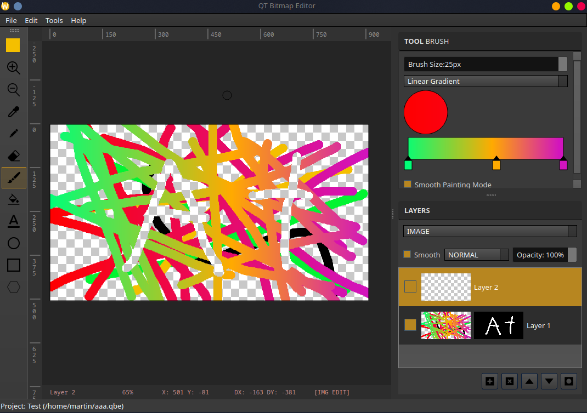

# QtBitmapEditor

TODO:
* GRID SYSTEM
* RECTANGLE TOOL
* CIRCLE TOOL
* GRADIENT TOOL
* PEN TOOL
* RECTANGLE SELECT
* LASSO SELECT
* MAGIC WAND
* BLOOR TOOL
* SHRAPEN TOOL
* CROP TOOL
* HEALING BRUSH TOOL
* SCRIPT BRUSH TOOL
* FILTERS
* CAMERA RAW FILTER

> Default preview of current version

