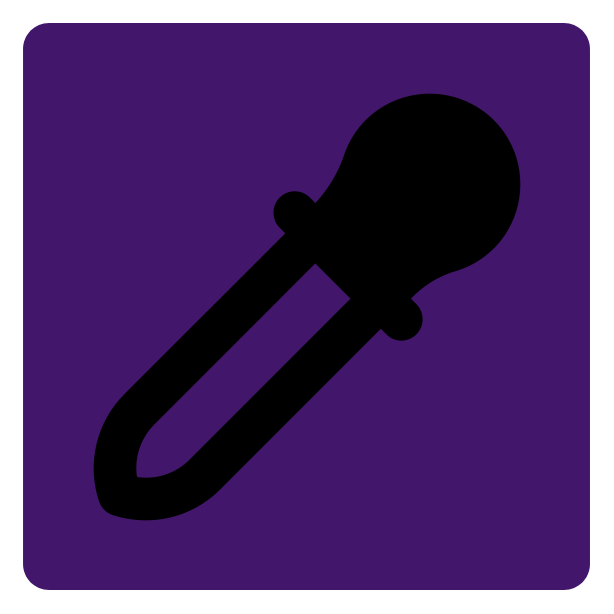

    
    <h1>Qt Bitmap Editor</h1>

  
  
  
  

Qt Bitmap Editor is a multi-platform application written in C++ and utilizing the Qt framework. It is a raster graphics editor that allows users to edit bitmap images and work with raster graphics. This application is designed to be user-friendly and intuitive. 

    
    <a>&nbsp;&nbsp;&nbsp;&nbsp;&nbsp;&nbsp;</a>
       

## 🌅 Workspace

On the left-hand side, there is a tool panel that provides users with various editing options. The options include color selection, zoom-in and zoom-out functionality, pencil and brush tools, a color picker, a fill tool, and a text tool. These tools make it easy to modify images in a variety of ways.

On the top-right corner of the software, there is a panel that displays settings for the currently selected tool. This panel allows users to adjust the settings of each tool to achieve the desired results.

At the bottom-right corner of the software, there is a layer editor that allows users to manage the different layers of an image. Users can add or remove layers, change their order, and adjust the properties of each layer.

> Base layout

## 🔧 Tools

### Color selector
The first tool in the toolbar is the color selector, which allows the user to select a color to be used as the primary color when using other drawing tools. This tool is located at the beginning of the toolbar.

### Zoom in/out

    
    

The second tool is the zoom in and zoom out tool, which allows the user to zoom in and out of the image. There is a wide range of zoom levels available. When the user zooms in on the image, a pixel grid is displayed, making it easier to edit individual pixels.

> Layer editor

### Color picker

The next tool is the color picker tool, which allows the user to select a color directly from the resulting image by clicking on a specific pixel. The current color of the pixel the user is pointing at is always displayed along with the currently selected primary color for comparison. If the user clicks on a chosen color in the image, it is selected as the primary color and saved to the color history.

> Color picker

### Pencil

The pencil tool is the simplest tool, allowing the user to draw on the image with the selected color and thickness.

### Eraser

The eraser tool allows the user to erase pixels in the selected raster layer.

### Brush

The brush tool is similar to the pencil tool in that it allows the user to draw on the image, but with the added ability to draw patterns. There are several basic, simple patterns available and the option to draw gradients.

### Fill

The fill tool is designed to fill a certain area with a selected color. It is possible to choose the tolerance, overall or within each color spectrum (red, green, blue).

### Text

The text tool allows the user to insert any text into the raster image. Text can be customized by adjusting its color, size, font, and position. The text is created as a separate vector layer and cannot be edited using raster tools. To do so, the layer must be converted from vector to raster using the menu (right-click) in the layer editor.

## 🧱 Layer editor

The layer editor is a panel that allows for complete management and manipulation of layers. It allows for creating and deleting layers, as well as creating and deleting layer masks. 
It is possible to set any layer attributes, such as blend mode, opacity, layer name, and more. 

In the top section, there are elements for setting the display and rendering of layers. In the middle, there is a list of all layers with previews. At the very bottom, there are basic tools for manipulating layers.

> Layer editor

### Move up/down

    
    

The Move Up/Down tool allows users to change the order of layers in the layer stack. With this tool, users can move a selected layer up or down in the stack, changing its position in the order of layers. This can be useful for changing the visibility of layers or adjusting the order of layers to achieve a desired effect in the final image.

### New layer

The New Layer tool creates a new layer in the image. Layers are used to organize and separate different elements of the image, allowing for easier editing and manipulation.

### Remove layer

The "Remove layer" button is a tool used in the layer editor panel to delete the selected layer from the image. 

### Mask create/remove

The Mask create/remove button allows the user to create or remove a mask for the currently selected layer. The mask will then be displayed next to the layer's image in the layer list. 

By switching the editing mode from "IMAGE" to "MASK" (or using CTRL + W), the user can enter the mask editing mode. In this mode, only the mask and the image preview are displayed in the workspace, and the user can use raster tools to edit the mask shape.

> Mask edito preview 

--- 

## 🔨 TODO
* [ ] TRANSFORMATIONS
* [ ] GRID SYSTEM
* [ ] RECTANGLE TOOL
* [ ] CIRCLE TOOL
* [ ] GRADIENT TOOL
* [ ] PEN TOOL
* [ ] RECTANGLE SELECT
* [ ] LASSO SELECT
* [ ] MAGIC WAND
* [ ] BLOOR TOOL
* [ ] SHRAPEN TOOL
* [ ] CROP TOOL
* [ ] HEALING BRUSH TOOL
* [ ] SCRIPT BRUSH TOOL
* [ ] FILTERS
* [ ] CAMERA RAW FILTER
* [ ] Optimization (Multiple Threads)

--- 

## 👤 Author
This software was developed by Martin Krčma.

## 📄 License
This software is released under the MIT license.